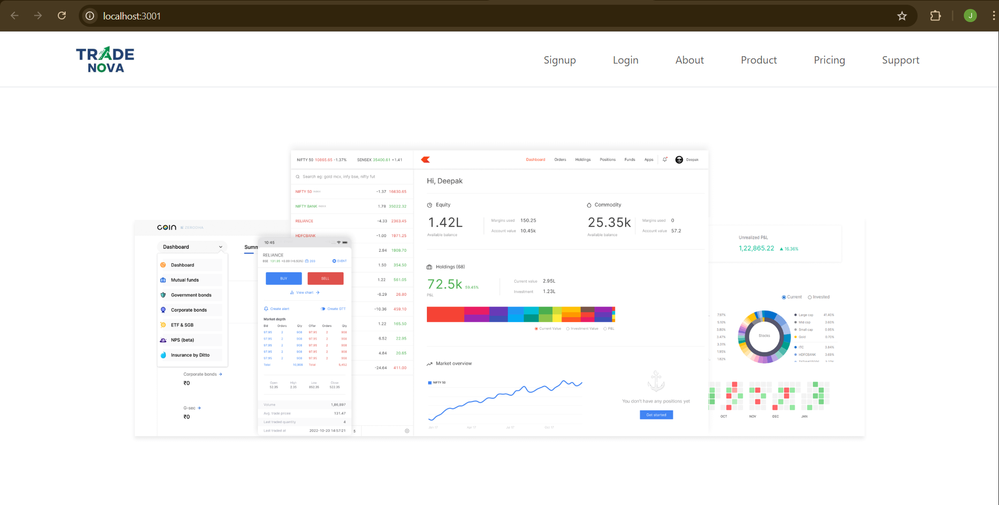
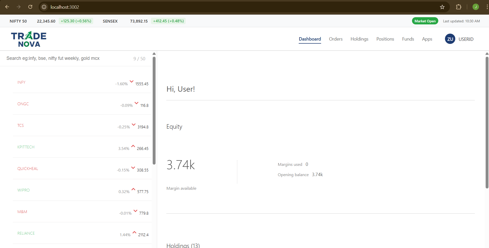
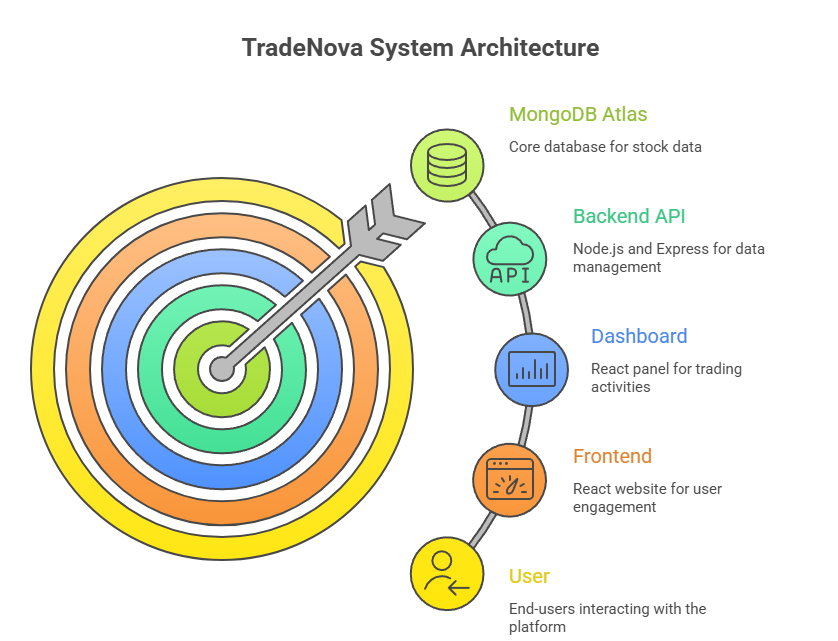
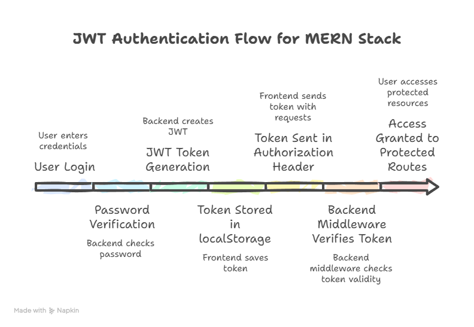

# TradeNova – Full Stack Stock Trading Platform

TradeNova is a full-stack MERN-based stock trading platform built to simulate a modern brokerage system. The project consists of a public marketing website, an authenticated trading dashboard, and a secure backend API using JWT authentication.

---

## Overview

The application is divided into three main parts:

- **Frontend** – Public-facing website
- **Dashboard** – Authenticated trading interface
- **Backend** – REST API with MongoDB and JWT authentication

---

## Tech Stack

### Frontend
- React.js
- React Router
- Bootstrap

### Dashboard
- React.js
- Chart.js
- Axios

### Backend
- Node.js
- Express.js
- MongoDB Atlas
- JWT Authentication
- Bcrypt (Password Hashing)

---

## Features

- User registration and login
- Secure JWT-based authentication
- Protected backend routes
- Buy and sell order execution
- Automatic holdings update logic
- Positions tracking
- Order history storage
- MongoDB database integration

---

## Project Structure
```
TradeNova/
│
├── frontend/       # Public website
├── dashboard/      # Trading dashboard
├── backend/        # Express API and database logic
└── README.md
```

---

## Authentication Flow

1. User registers via frontend
2. Password is hashed using bcrypt
3. User logs in
4. Backend generates JWT token
5. Token is stored in localStorage
6. Token is sent in Authorization header
7. Backend middleware verifies token
8. Protected routes become accessible

---

## Order Execution Logic

### Buy Order
- If a holding exists, quantity and average price are updated
- If a holding does not exist, a new holding is created

### Sell Order
- Quantity validation is performed
- Holding quantity is reduced
- If quantity reaches zero, the holding is deleted
- Order is stored in the Orders collection

---

## Local Installation

### 1. Clone the Repository
```bash
git clone https://github.com/YOUR_USERNAME/TradeNova.git
cd TradeNova
```

### 2. Backend Setup
```bash
cd backend
npm install
```

Create a `.env` file inside the `backend` folder:
```env
MONGO_URL=your_mongodb_connection
JWT_SECRET=your_secret_key
PORT=3003
```

Run the backend:
```bash
npm start
```

Runs on: `http://localhost:3003`

### 3. Frontend Setup
```bash
cd frontend
npm install
npm start
```

Runs on: `http://localhost:3001`

### 4. Dashboard Setup
```bash
cd dashboard
npm install
npm start
```

Runs on: `http://localhost:3002`

---

## Screenshots




---

## System Architecture




---

## Author

**Jaineel Hemnani**  
Full Stack Developer

---

## Note

This project was built for portfolio and learning purposes to demonstrate secure full-stack application development using the MERN stack.