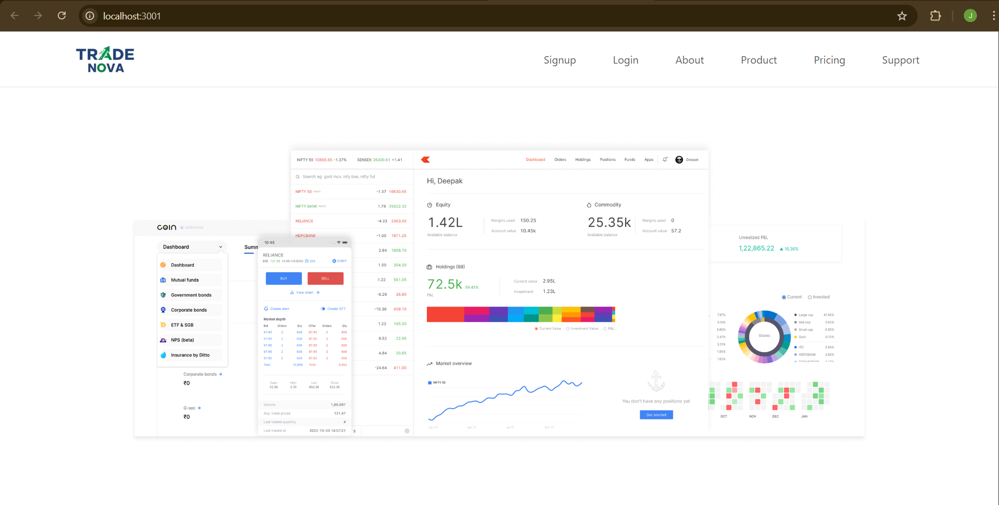
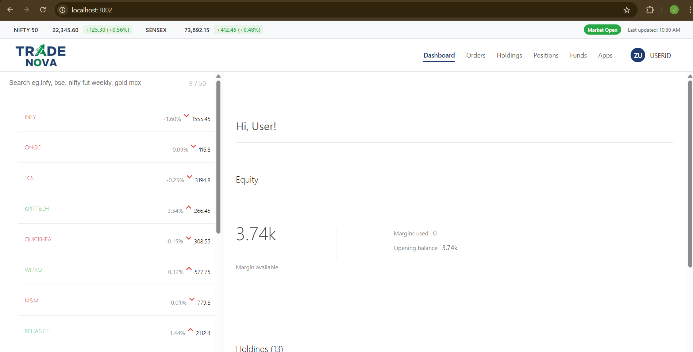
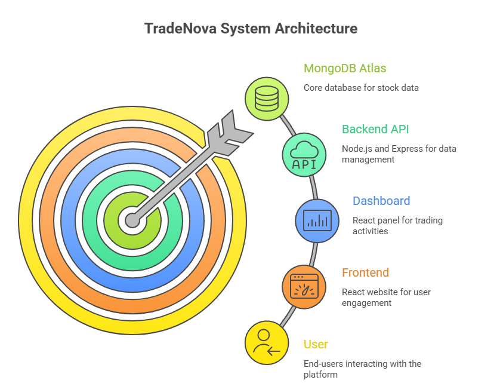
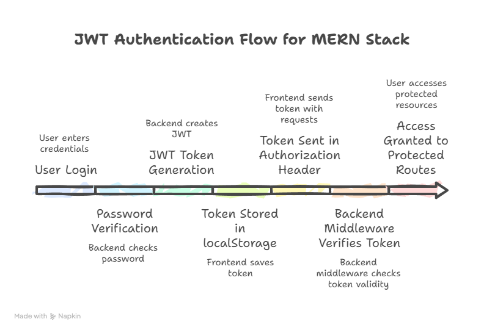

# TradeNova – Paper-Trading Platform

TradeNova is a full-stack paper-trading platform: a public marketing site and an authenticated trading
application in one product, backed by a JWT-secured REST API, real market data, and an AI portfolio assistant.

Every account starts with **₹1,00,000 in simulated capital**. Orders execute at the real, live market price —
never a price you set yourself — and update your balance, holdings, and portfolio value exactly as a real
brokerage would. No real money is ever involved, and TradeNova is not connected to any brokerage or exchange
for order execution.

---

## Architecture

TradeNova has **one canonical frontend** (`dashboard/`) serving both the public site and the trading
application from a single React Router tree, and one backend API.

```
TradeNova/
├── backend/          Express REST API, MongoDB, JWT auth, market data, AI assistant
├── dashboard/         ← canonical frontend (public site + trading app)
│   ├── public/
│   └── src/
│       ├── components/    shared UI: cards, charts, trade dialog, state components
│       ├── context/        AuthContext (JWT session, ProtectedRoute)
│       ├── layout/          PublicLayout (marketing) + AppShell/Sidebar/Topbar (trading)
│       ├── pages/            Home, About, Product, Pricing, Support, Login, Signup,
│       │                    Dashboard, Markets, Stock Detail, Orders, Holdings,
│       │                    Positions, Funds, Watchlist, AI Assistant
│       ├── config/            API base URL + axios client (JWT interceptor, 401 handling)
│       └── utils/
├── frontend/          legacy public-site prototype — retained temporarily, not part of
│                      the live product (see note below)
└── screenshots/       reference images
```

> **`frontend/` is legacy.** It was an earlier, separate public-site implementation with no trading
> functionality and no working connection to the current backend. Everything it did has been rebuilt inside
> `dashboard/` with accurate, up-to-date content. It's kept in the repository temporarily pending a final
> decision to remove it.

### Frontend

- React (Create React App) + MUI, one `react-router-dom` v6 tree.
- `PublicLayout` renders the marketing site (`/`, `/about`, `/product`, `/pricing`, `/support`); `AppShell`
  (sidebar + topbar) renders the authenticated trading app under `/dashboard/*`, gated by `ProtectedRoute`.
- A single axios instance (`config/apiClient.js`) attaches the JWT to every request and handles session
  expiry centrally.
- Charts via `chart.js`/`react-chartjs-2`.

### Backend

- Node.js + Express, MongoDB via Mongoose.
- JWT authentication (bcrypt-hashed passwords); every trading/portfolio/watchlist route is scoped to the
  authenticated user.
- Order execution is server-authoritative: the execution price always comes from a live quote fetched at
  order time, never from the client, with atomic balance/quantity guards against concurrent-request races.

### Market data

Live quotes and historical price charts (1D/1W/1M/3M/1Y) via **Yahoo Finance** (`yahoo-finance2`). Bare
Indian tickers (e.g. `TCS`) resolve against the NSE listing first; qualified symbols (`INFY.NS`,
`RELIANCE.BO`) and indices (`^NSEI`, `^BSESN`) are supported directly.

### AI assistant

A **Google Gemini** (`gemini-2.5-flash`) powered portfolio assistant, grounded in the authenticated user's
live balance, holdings, and orders. Advisory only — it cannot place, modify, or cancel trades.

---

## Features

- User registration and login (JWT)
- Paper trading: buy/sell execution at live market prices, with balance and quantity validation
- Weighted-average cost tracking on holdings
- Portfolio dashboard: balance, portfolio value, P&L, allocation, holdings, recent orders
- Order history
- Markets: symbol search, index quotes (NIFTY 50, SENSEX), stock detail with historical chart
- Watchlist with live prices
- AI portfolio assistant

---

## Local setup

### 1. Clone the repository

```bash
git clone https://github.com/YOUR_USERNAME/TradeNova.git
cd TradeNova
```

### 2. Backend

```bash
cd backend
npm install
```

Create `backend/.env`:

```env
MONGO_URL=your_mongodb_connection_string
JWT_SECRET=your_jwt_secret
PORT=3003
GEMINI_API_KEY=your_gemini_api_key
```

```bash
npm start
```

### 3. Frontend (dashboard/)

```bash
cd dashboard
npm install
npm start
```

By default the frontend talks to the production API (`dashboard/src/config/api.js`). For local development
against your own backend, set `REACT_APP_API_URL=http://localhost:3003` (e.g. in `dashboard/.env.development`
or the shell environment) before `npm start`.

---

## Deployment

`dashboard/` is the only application that should be deployed as the public-facing TradeNova product — set
your hosting provider's project root/build directory to `dashboard/` (standard CRA build: `npm run build`,
output in `dashboard/build/`). `backend/` deploys separately as a Node service; its `CORS` origin list
(`backend/src/app.js`) must include whichever domain serves `dashboard/`.

---

## Screenshots




## System architecture




---

## Author

**Jaineel Hemnani**
Full Stack Developer

---

## Note

This project was built for portfolio and learning purposes, to demonstrate secure full-stack application
development using the MERN stack. It is a paper-trading simulator — not a real brokerage, and not connected
to any real trading or settlement system.
