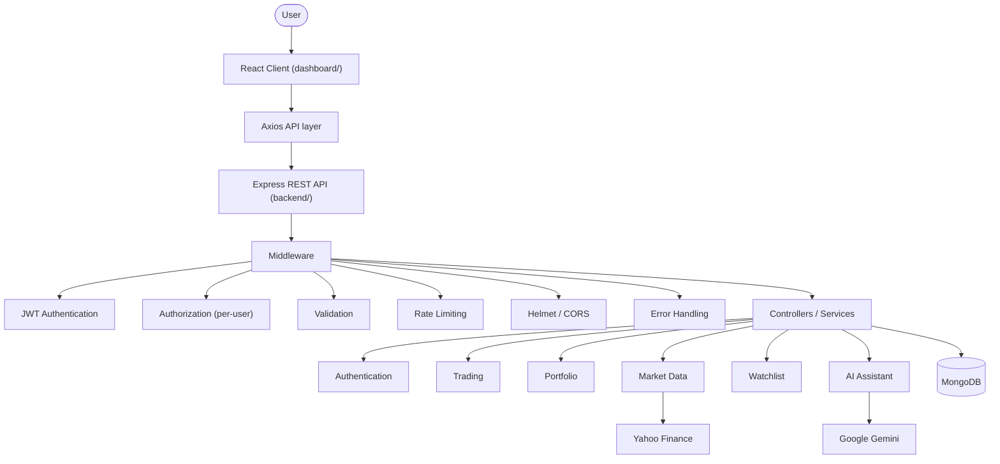
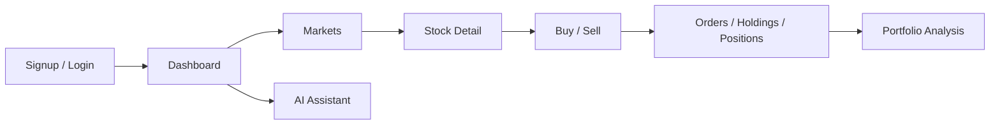

# TradeNova

A full-stack MERN paper-trading platform — real market data, a server-authoritative simulated brokerage
backend, portfolio analytics, and a Gemini-powered AI assistant, with no real money ever involved.


## Project Overview

Every account opens with **₹1,00,000 in simulated capital**. Orders execute at a real, live market price
fetched server-side — never a price the client supplies — and the same balance/holding arithmetic a real
brokerage needs (average-cost tracking, insufficient-funds checks, P&L) runs underneath it. It's the closest
a paper-trading demo gets to the real thing, minus the risk.

## Key Features

| Area | What it does |
|---|---|
| **Trading** | Server-priced simulated buy/sell, insufficient-funds/holdings rejection, weighted-average cost tracking |
| **Portfolio** | Live balance, portfolio value, unrealized P&L (₹ and %), allocation breakdown |
| **Markets** | Symbol search, index quotes (NIFTY 50, SENSEX), historical price chart per stock |
| **Watchlist** | Live prices, add/remove, one-click into a trade |
| **Records** | Order history, holdings, delivery-style positions, funds summary |
| **AI Assistant** | Google Gemini, answers grounded only in the signed-in user's own portfolio |
| **Auth** | JWT sessions, bcrypt password hashing |
| **Security** | Per-user authorization, rate limiting, Helmet headers, CORS allowlist, server-side validation |

## System Architecture


```mermaid
flowchart TD
    User([User]) --> Client["React Client (dashboard/)"]
    Client --> API["Axios API layer"]
    API --> Express["Express REST API (backend/)"]

    Express --> MW["Middleware"]
    MW --> MW1["JWT Authentication"]
    MW --> MW2["Authorization (per-user)"]
    MW --> MW3["Validation"]
    MW --> MW4["Rate Limiting"]
    MW --> MW5["Helmet / CORS"]
    MW --> MW6["Error Handling"]

    MW --> Services["Controllers / Services"]
    Services --> S1["Authentication"]
    Services --> S2["Trading"]
    Services --> S3["Portfolio"]
    Services --> S4["Market Data"]
    Services --> S5["Watchlist"]
    Services --> S6["AI Assistant"]

    Services --> DB[("MongoDB")]
    S4 --> Ext1["Yahoo Finance"]
    S6 --> Ext2["Google Gemini"]
```

There is **one canonical frontend** (`dashboard/`) — it serves both the public marketing pages and the
authenticated trading app from a single React Router tree. There is no separate marketing-site codebase.

## Application Flow


```mermaid
flowchart LR
    A["Signup / Login"] --> B["Dashboard"]
    B --> C["Markets"]
    C --> D["Stock Detail"]
    D --> E["Buy / Sell"]
    E --> F["Orders / Holdings / Positions"]
    F --> G["Portfolio Analysis"]
    B --> H["AI Assistant"]
```


## Tech Stack

| Layer | Technologies |
|---|---|
| **Frontend** | React 18 (Create React App), React Router v6, MUI v5, Chart.js / react-chartjs-2, Axios |
| **Backend** | Node.js, Express 5 |
| **Database** | MongoDB, Mongoose |
| **Auth/Security** | JWT (`jsonwebtoken`), bcrypt (`bcryptjs`), Helmet, custom rate limiter |
| **External APIs** | Yahoo Finance (`yahoo-finance2`), Google Gemini (`@google/genai`) |
| **Testing** | Jest + Supertest + `mongodb-memory-server` (backend), Jest + React Testing Library (frontend) |
| **CI/CD** | GitHub Actions |
| **Deployment** | Vercel (frontend), Render (backend) |

## Security

- **Passwords** hashed with bcrypt — never stored or logged in plaintext.
- **Authentication**: JWT verified on every protected route; a generic "Invalid credentials" message on login
  failure resists user enumeration.
- **Authorization**: every trading/portfolio/watchlist endpoint scopes to the user ID from the verified JWT —
  never a client-supplied ID — so one account can never read or modify another's data. Covered by a dedicated
  cross-user authorization test suite.
- **Trading integrity**: execution price always comes from a server-fetched live quote; balance/holding checks
  use atomic MongoDB updates to prevent race conditions from concurrent or duplicate requests.
- **Validation**: server-side checks on every input (email, password, username, order fields, AI question
  length) — the backend is the final authority, not the frontend.
- **Rate limiting**: login, registration, order placement, and the AI assistant are all limited per-IP/user.
- **Headers/CORS**: Helmet security headers; an explicit origin allowlist, never `*`.
- **Error handling**: unexpected errors are logged server-side but return a generic message to the client —
  no stack traces or internals leaked.
- **Secrets**: nothing committed to git; `.env` is gitignored, `.env.example` holds placeholders only.

## Testing

```bash
cd backend && npm test            # 85 tests, 9 suites
cd dashboard && npm test          # 31 tests, 4 suites
```

Backend tests run against a real in-process MongoDB (`mongodb-memory-server`) with Yahoo Finance and Gemini
mocked — no external services, no real credentials needed. Dashboard tests mock the shared API client, so
nothing depends on a live backend. Backend statement coverage is ~91.6%, concentrated on the parts that
matter most: authentication, cross-user authorization, order execution/validation, portfolio math, watchlist
CRUD, and AI-context isolation. A GitHub Actions workflow runs both suites plus the production build on every
push and pull request.

## Project Structure

```
TradeNova/
├── .github/workflows/       CI: backend tests, dashboard tests, production build
├── backend/
│   ├── src/
│   │   ├── controllers/        route handlers
│   │   ├── services/            business logic (auth, trading, portfolio, market data, watchlist, AI)
│   │   ├── models/               Mongoose schemas
│   │   ├── middleware/            auth, rate limiting, error handling
│   │   ├── validators/            input validation
│   │   └── routes/                 Express routers
│   └── tests/                  unit + integration tests, external-service mocks
├── dashboard/                   ← canonical frontend (public site + trading app)
│   ├── public/
│   └── src/
│       ├── components/            shared UI: cards, charts, trade dialog
│       ├── context/                 AuthContext (JWT session, ProtectedRoute)
│       ├── layout/                    PublicLayout + AppShell/Sidebar/Topbar
│       ├── pages/                       Home, About, Product, Pricing, Support, Login, Signup,
│       │                                Dashboard, Markets, Stock Detail, Orders, Holdings,
│       │                                Positions, Funds, Watchlist, AI Assistant
│       └── config/                        API base URL + axios client
└── screenshots/                reference images
```

## Environment Variables

`backend/.env.example` documents every variable — copy it to `backend/.env` and fill in real values.

| Variable | Required | Purpose |
|---|---|---|
| `MONGO_URL` | Yes | MongoDB connection string |
| `JWT_SECRET` | Yes | Signs/verifies authentication tokens |
| `PORT` | No (default 3003) | Backend listen port |
| `GEMINI_API_KEY` | No (assistant returns 503 if unset) | Google Gemini API key |
| `ALLOWED_ORIGINS` | No | Comma-separated CORS allowlist override |
| `*_RATE_LIMIT_MAX` / `*_WINDOW_MS` | No | Rate-limit tuning |

The dashboard needs no secrets — `REACT_APP_API_URL` is the only variable, and it's a public API base URL.

## Local Setup

```bash
git clone https://github.com/Jaineel22/TradeNova-MERN-Trading-Platform.git
cd TradeNova

# Backend
cd backend
npm install
cp .env.example .env   # fill in MONGO_URL, JWT_SECRET, GEMINI_API_KEY
npm start

# Dashboard (new terminal)
cd dashboard
npm install
npm start
```

By default the dashboard talks to the deployed production API. For local development against your own
backend, set `REACT_APP_API_URL=http://localhost:3003` before `npm start`.

## API / Backend Overview

The backend is a standard layered Express REST API: **routes → controllers → services → Mongoose models**.
Routes wire up middleware (JWT auth, rate limiting, validation) and delegate to controllers; controllers stay
thin and delegate business logic to services; services own the actual trading/portfolio/watchlist logic and
are what's unit/integration tested. Six route groups: auth, orders, market data, portfolio, watchlist, AI
assistant.

## AI Assistant

The AI assistant is a portfolio-aware chat backed by Google Gemini. The backend builds the model's context
from the authenticated user's own holdings, orders, and balance — resolved from the verified JWT, never from
anything the client sends — and the system prompt is written to resist prompt injection from user input. If
`GEMINI_API_KEY` isn't configured, the endpoint returns a clear 503 instead of failing silently.

## Paper Trading Disclaimer

TradeNova is a **simulation only**. No real money, real brokerage, or real exchange/settlement system is
involved anywhere in the application. Market prices are sourced from Yahoo Finance's public data for realism,
but are not guaranteed real-time or exchange-accurate, and nothing here should be used to make real trading
decisions.

## Deployment

- **Frontend**: `dashboard/` deployed as a static build on Vercel.
- **Backend**: deployed as a Node web service on Render.
- The backend's CORS allowlist (`backend/src/app.js`, overridable via `ALLOWED_ORIGINS`) must include whatever
  domain serves the deployed frontend.

## Known Limitations / Future Improvements

- Paper trading only — no real brokerage integration, by design.
- "Positions" tracks delivery-style holdings only; there's no separate intraday-position engine.
- No historical portfolio-value chart yet — only a live snapshot.
- A few dashboard pages are covered by backend integration tests and manual QA rather than dedicated
  component tests.
- No automated browser-based end-to-end suite runs in CI yet.

## Author

**Jaineel Hemnani** — Full Stack Developer
